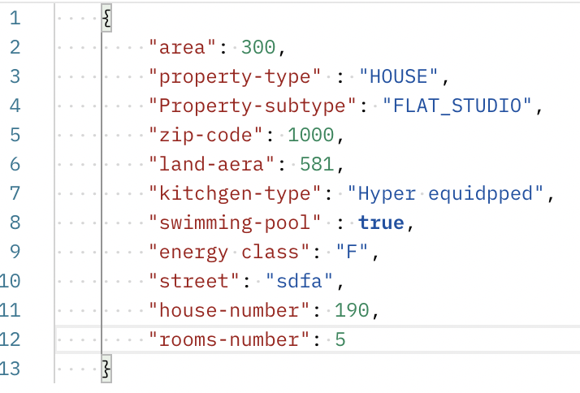
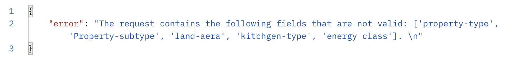
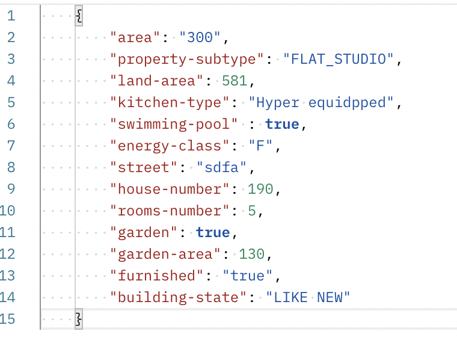
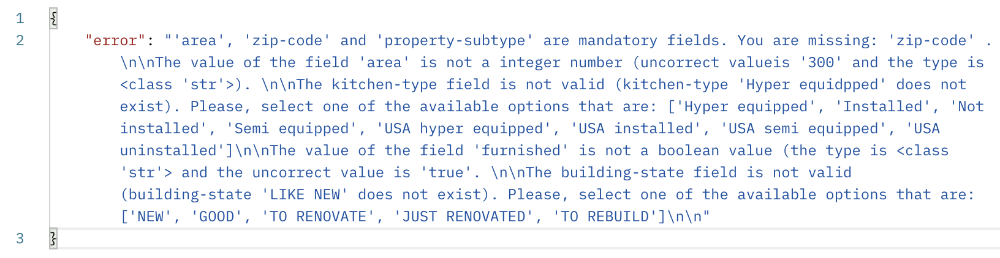
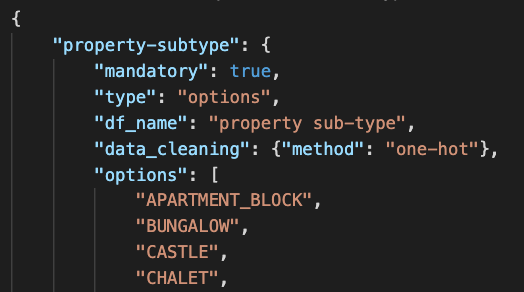
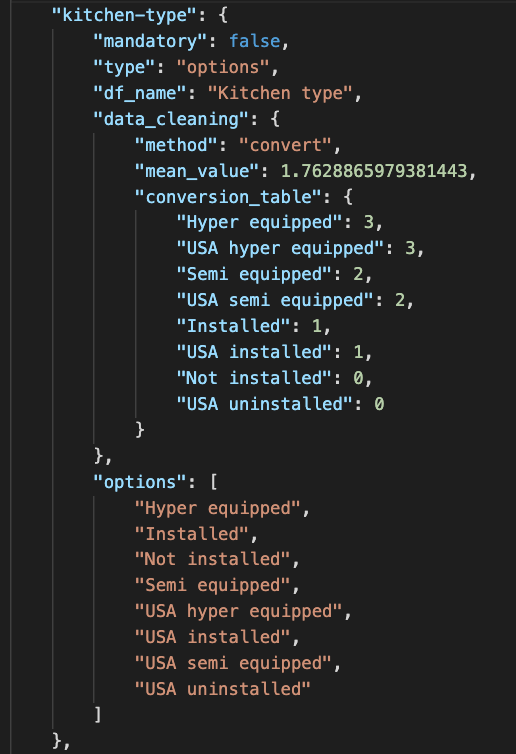
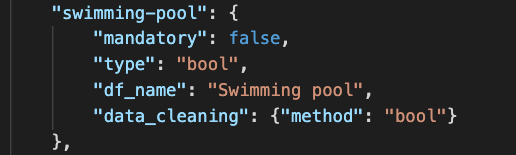
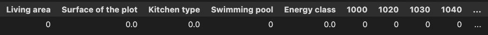

# ImmoEliza_API

## Description

This application predicts a price for a house. Application has an API interface that takes json file as a parameter and as a return value the user gets prediction for the house price. The API is descripted in paragraph 'data description'


##  Required modules and versions


| Module        | Version  |
|---------------| ---------|
| numpy         | 1.22.3   |
| flask         | 2.1.0    |
| pandas        | 1.4.1    |
| requests      | 2.27.1   |
| pycurl        | 7.45.1   |
| matplotlib    | 3.5.1    |

Heroku


### data description


```json
{"data": 
	{"property-subtype" : ["APARTMENT_BLOCK" | "BUNGALOW" | "CASTLE" | "CHALET" | "COUNTRY_COTTAGE" | "DUPLEX" | 
      	                 "EXCEPTIONAL_PROPERTY" | "FARMHOUSE" | "FLAT_STUDIO" | "GROUND_FLOOR" | "KOT" | "LOFT" | 
         	              "MANOR_HOUSE" | "MANSION" | "MIXED_USE_BUILDING" | "OTHER_PROPERTY" | "PENTHOUSE" | "SERVICE_FLAT" | 
                	      "TOWN_HOUSE" | "TRIPLEX" | "VILLA"],
	"area" : int,
	"kitchen-type" : Optional["Hyper equipped" | "Installed" | "Not installed" | "Semi equipped" | "USA hyper equipped" |
								 "USA installed" | "USA semi equipped" | "USA uninstalled"],
	"energy-class" : Optional["A" | "A+" | "A++" | "B" | "C" | "C_B" | "D" | "E" | "F" | "F_B" | "F_D" | "G" | 
                        	"G_C" | "G_D" | "G_F"],
	"land-area" : Optional(int),
	"house-number" : Optional(int),
	"swimming-pool" : Optional(bool),
	"street" : Optional(str),
	"rooms-number" : Optional(int),
	"garden" : Optional(bool),
	"garden-area" : Optional(int),
	"furnished" : Optional(bool),
	"open-fire" : Optional(bool),
	"terrace" : Optional(bool),
	"terrace-area" : Optional(int),
	"facades-number" : Optional(int),
	"building-state" : Optional["NEW" | "GOOD" | "TO RENOVATE" | "JUST RENOVATED" | "TO REBUILD"],
	"zip-code" : int 
	}
}
```
*data description is generated from features\_meta\_data.json -file. Therefore, it's always up to date.*

## Application Program Interface (API)

**Tähän jotain typerää läppää miten otetaan yhteys Herokuun ja mikä on osoite ja muuta sellaista soopaa.**


| POST/GET        | Address  | Response  |
|---------------|----------|----------|
| GET         | <URL>/   | {"status": "alive"}        |
| GET         | <URL>/predict   | \<data description>*        |
| POST     | <URL>/predict + dictionary*  | {"prediction" : \<price prediction>***}        |
<br> \* Dictionary format is descripted in 'Data description' paragraph
<br> \** For example: '227000'


## Errors

#### Accepted keys
Application accepts these and only keys (for ex. 'property-subtype', 'area', 'kitchen-type' etc) that are shown in the dictonary above. To prevent typos or other mistakes, API will send an error message to the user if any other keys are used. Error message specifies what is the wrong key.

#### If not 'Optional' the field is mandatory
Key is mandatory, unless there is text 'Optional'. If any of the mandatory fields are missing from the dictionary an error message will be send to the user. Message specifies what key values are missing.

#### Data types and listed items

There are several types for data like bool, int, string and listed item. Such as 'property-suptype' values: "APARTMENT_BLOCK", "BUNGALOW", "CASTLE" etc. If the type is listed item, only listed values will be accepted. 
<br>Error message specifies what key has a wrong value, what the actual type should be and what type/value the user had send to the API. 

#### Only existing zip-codes are accepted
'zip-code' has been descriped as int. However, API checks that the zip-code actually exists in Belgium and if it doesn't an error message to the user will be send.

#### Example: errors with dictionary's key values
In the following example several dictionary keys have problems.

*<br>Example dictionary that contains several key-errors ('property-type' does not exists, 'Property-subtype' is with capital letter, typo: 'land-aera' and 'kitchgen-type', missing dash: 'energy class')*



*<br>An error message for previous dictionary. All the key's are checked at the same time, but other possible errors are not yet checked.*

#### 1. Keys are checked first

If API receives dictionary that has incorrect key values, these will be checked first and error message will be send to the user. At this point no other error messages are send to the user, even if the values are incorrect. It would be confusing for the user otherwise.


### 2. The rest of the values are checked at the same time

All of the other errors (except keys) will be checked at the same time. That way it's more convinient for the user. If there are any errors, user will recieve only one error message that contains all the existing problems. Once these are fixed, the user receives the prediction for the house.
To make it easier to the user, all the errors will be listed in the error message (in the case JSON file has several problems). 
*
<br>Example dictionary with several errors*


*<br>This is how the error message looks in the postman. A dictionary is not very readable. It recomended to print out the messages (see below)*


*<be>The same error message printed in the terminal. All the error messages are send at the same time to the user.*


##  Updating prediction model

There is no need to change the code if the prediction model is changed. The application is a generic solution and can use any linear regression model and any data set. However there are three files that need to be updated if the prediction model changes:

### features\_meta\_data.json

This file is the hearth of this application. It defines how API works, what values are accepted or required, when error messages are send and how the data cleaning will be made. This file contains meta data of the features, their data types, possible values, cleaning information etc. 


<br>*"property-subtype" uses options. Only these values are accepted*.

**Example 1:**
<br> - "mandatory": true/false, if true "property-subtype" is a mandatory field in the API
<br> - "type": datatype in this case it's 'options' (list of choises). It could be also for ex. 'bool', 'int' or 'str'.
<br> - "data cleaning method". In this case it's one-hot encoding. The cleaning.py reads this value and acts accordingly
<br> - "options". Since the type is 'options' for this feature, all the possible options are listed here. Only these values are accepted in the API. It's possibly to add values to this list, but also the prediction model should be updated.


<br>*Kitchen-type feature uses a conversion table. With that the values are calculated to prediction model.*

**Example 2:**
<br> - This example shows also conversion table and a mean value that are used in the data cleaning


<br>*Swimming-pool -feature is one of the simplest ones*

**Example 3:**
<br> - Data type is boolean. Therefore option list is not needed
<br> - "df_name" defines the column name that is used in the data frame.

### model_row.pickle

Application creates a data frame from the values that API got as a JSON file. It's vital that in this dataframe all the columns are in the same order than in the original training model. Because of dummies, thare are well over 200 columns. The easiest way to be sure that all columns exists and are in the same order as in the original training data frame is to use a small sample data frame. That's why this file is created (model_row.pickle)It has all the columns, but only one row. All the values are zero. Zeros will be replaced by cleaning.py. 



*In this picture only first few columns are presented. cleaning.py replaces zeros using feature_meta_data.json file*

### theta.pickle
