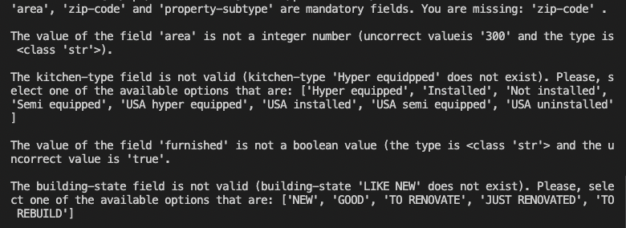

# ImmoEliza_API

This app predicts the price of a house. For that the app needs some information about the house. As a response the user receives the price prediction. Information is delivered through the API, it's described in this document.

Table of content

- [ImmoEliza_API](#immoeliza_api)
- [Required modules and versions](#required-modules-and-versions)
- [Several prediction models](#several-prediction-models)
- [Creating and Updating prediction model](#creating-and-updating-prediction-model)
  - [features\_meta\_data.json](#features_meta_datajson)
  - [model_row.pickle](#model_rowpickle)
  - [theta.pickle](#thetapickle)
- [Application Program Interface (API)](#application-program-interface-api)
  - [Alive (Method: 'GET', Address: '/' )](#alive-method-get-address--)
  - [Prediction](#prediction)
    - [Getting the information what to post (Method: 'GET', Address: '/predict' )](#getting-the-information-what-to-post-method-get-address-predict-)
    - [Getting the price prediction (Method: 'POST', Address: '/predict' )](#getting-the-price-prediction-method-post-address-predict-)
  - [SETUP](#setup)
    - [Getting the info about current model (Method: 'GET', Address: '/setup' )](#getting-the-info-about-current-model-method-get-address-setup-)
    - [Chancing the model  (Method: 'POST', Address: '/setup' )](#chancing-the-model--method-post-address-setup-)
  - [Errors](#errors)
    - [Accepted keys](#accepted-keys)
    - [Optional and mandatory fields](#optional-and-mandatory-fields)
    - [Data types and listed items](#data-types-and-listed-items)
    - [Only existing zip-codes are accepted](#only-existing-zip-codes-are-accepted)
    - [Example: errors with dictionary's key values](#example-errors-with-dictionarys-key-values)
    - [1. Keys are checked first](#1-keys-are-checked-first)
    - [2. The rest of the values are checked at the same time](#2-the-rest-of-the-values-are-checked-at-the-same-time)


#  Required modules and versions

The application runs in the Heroku environment, so the user does not need to install the development environment. However, if you want to do development work, the following libraries are needed.

| Module     | Version |
| ---------- | ------- |
| numpy      | 1.22.3  |
| flask      | 2.1.0   |
| pandas     | 1.4.1   |
| requests   | 2.27.1  |
| pycurl     | 7.45.1  |
| matplotlib | 3.5.1   |

The application is started with the following command: python app.py. This will launch the API. You need another program, such as Postman (https://www.postman.com), to use the API

# Several prediction models
The application supports several different price prediction models. They can have different API, features, data types, cleaning precess and prediction calculation. It is possible to change prediction model without restarting the service (on the fly). Each prediction model have a different API and a different data cleaning process, theta, columns etc. These are defined in the json file  (feature_meta_data.json).

'Several prediction models' -feature is implemented by separating code from data. The python code knows nothing about the content of the data. All metadata is defined in a JSON file (feature_meta_data.json). The application reads this file and by that information:
1. Creates an API
2. Performs error checking (feature names, data types, values, etc.)
3. Cleans the data: normalises values (if needed), converts non numeric values to numeric, handles null values etc.
4. Calculates the price forecast
5. Also the 'GET /prediction' -info is generated from this file. By that way it's always up to date when updating the model. 

Under 'model' -folder is a subfolder for each prediction model. There are three files: 
1. feature_meta_data.json - meta data for the dataset
2. model_row.pickle - dataframe that defines the columns for the model
3. theta.pickle - trained theta is used to calculate the prediction

Currently there are three different prediction models:
1. Normal - this is exactly the same what is described in the challenge. 
2. Light - there are only seven best working features
3. Optimal - this is a compromise between two previous ones. It contains the best features, but minimum differences to the challenge description.

The 'heart' of the 'Several prediction models' -feature is the feature_meta_data.json. Here is an example how the data is defined in this file. This example is from "kitchen-type". 

'''json
"kitchen-type": {
        "mandatory": false,
        "type": "options",
        "df_name": "Kitchen type",
        "data_cleaning": {
            "method": "convert",
            "mean_value": 1.7628865979381443,
            "conversion_table": {
                "Hyper equipped": 3,
                "USA hyper equipped": 3,
                "Semi equipped": 2,
                "USA semi equipped": 2,
                "Installed": 1,
                "USA installed": 1,
                "Not installed": 0,
                "USA uninstalled": 0
            }
        },
        "options": [
            "Hyper equipped",
            "Installed",
            "Not installed",
            "Semi equipped",
            "USA hyper equipped",
            "USA installed",
            "USA semi equipped",
            "USA uninstalled"
        ]
    },
'''
Example feature from feature_meta_data.json file

#  Creating and Updating prediction model

There is no need to change the code if the prediction model is changed. The application is a generic solution and can use any linear regression model and any data set. However there are three files that need to be updated if the prediction model changes:

## features\_meta\_data.json

This file is the hearth of this application. It defines how API works, what values are accepted or required, when error messages are send and how the data cleaning will be made. This file contains meta data of the features, data types, possible values, cleaning information etc. 


<br>*"property-subtype" uses options. Only these values are accepted*.

**Example 1:**
<br> - "mandatory": true/false, if true "property-subtype" is a mandatory field in the API
<br> - "type": datatype in this case it's 'options' (list of choices). It could be also for ex. 'bool', 'int' or 'str'.
<br> - "data cleaning method". In this case it's one-hot encoding. The cleaning.py reads this value and acts accordingly
<br> - "options". Since the type is 'options' for this feature, all the possible options are listed here. Only these values are accepted in the API. It's possibly to add values to this list, but also the prediction model should be updated.


<br>*Kitchen-type feature uses a conversion table. With that the values are calculated to prediction model.*

**Example 2:**
<br> - This example shows also conversion table and a mean value that are used in the data cleaning


<br>*Swimming-pool -feature is one of the simplest ones*

**Example 3:**
<br> - Data type is boolean. Therefore option list is not needed
<br> - "df_name" defines the column name that is used in the data frame.

## model_row.pickle

Application creates a data frame from the values that API received from the request. It's vital that in this dataframe all the columns are in the same order than in the original training model. Because of dummies, thare are well over 200 columns. The easiest way to be sure that all columns exists and are in the same order as in the original training data frame is to use a small sample data frame. That's why this file is created (model_row.pickle)It has all the columns, but only one row. All the values are zero. Zeros will be replaced by cleaning.py. 


*In this picture only first few columns are presented. cleaning.py replaces zeros using feature_meta_data.json file*

## theta.pickle

Theta is used to calculate the prediction for the price. Theta is saved as a binary file, althought it's format is ndarray.


# Application Program Interface (API)

This section briefly describes the API interface and what data the interface expects.

| Usage      | Type | Address       |
| ---------- | ---- | ------------- |
| Alive      | GET  | <url>/        |
| Prediction | GET  | <url>/predict |
| Prediction | POST | <url>/predict |
| Setup      | GET  | <url>/setup   |
| Setup      | POST | <url>/setup   |

<url> = url address, for example http://127.0.0.1:5001

Please, see following chapters for more detailed information

## Alive (Method: 'GET', Address: '/' )
The purpose of 'Alive' is only to verify that the service is up and running. Here is an example of the return value:

'''json
{
    "status": "alive"
}
'''

## Prediction 
The application needs information from the user to calculate the price prediction. This request allows the user to provide information about the property, in which case the user is given price information.

The user can check what kind of information the application expects with the GET method. Examples of using GET and POST can be found below.


### Getting the information what to post (Method: 'GET', Address: '/predict' )
GET <url>/predict allows the user to see what kind of data the application needs to calculate the property price estimate.

The user can send a GET request to the application (GET: <url>/predict). The user gets back a dictionary (pls. see example below) that describes the needed data, data types and format.

The application supports several different prediction models that needs different information to make a price prediction. When using a different prediction model, the required input data is also different. With GET /predict you can easily check what kind of information is needed. For more information on the different prediction models, see the 'setup' chapter

This information is needed for 'Optimal' prediction model. Please, check the latest version always with the API.
```json
{"data": 
	{"property-subtype" : ["APARTMENT_BLOCK" | "BUNGALOW" | "CASTLE" | "CHALET" | "COUNTRY_COTTAGE" | "DUPLEX" | 
      	                 "EXCEPTIONAL_PROPERTY" | "FARMHOUSE" | "FLAT_STUDIO" | "GROUND_FLOOR" | "KOT" | "LOFT" | 
         	              "MANOR_HOUSE" | "MANSION" | "MIXED_USE_BUILDING" | "OTHER_PROPERTY" | "PENTHOUSE" | "SERVICE_FLAT" | 
                	      "TOWN_HOUSE" | "TRIPLEX" | "VILLA"],
	"area" : int,
	"kitchen-type" : Optional["Hyper equipped" | "Installed" | "Not installed" | "Semi equipped" | "USA hyper equipped" |
								 "USA installed" | "USA semi equipped" | "USA uninstalled"],
	"energy-class" : Optional["A" | "A+" | "A++" | "B" | "C" | "C_B" | "D" | "E" | "F" | "F_B" | "F_D" | "G" | 
                        	"G_C" | "G_D" | "G_F"],
	"land-area" : Optional(int),
	"house-number" : Optional(int),
	"swimming-pool" : Optional(bool),
	"street" : Optional(str),
	"rooms-number" : Optional(int),
	"garden" : Optional(bool),
	"garden-area" : Optional(int),
	"furnished" : Optional(bool),
	"open-fire" : Optional(bool),
	"terrace" : Optional(bool),
	"terrace-area" : Optional(int),
	"facades-number" : Optional(int),
	"building-state" : Optional["NEW" | "GOOD" | "TO RENOVATE" | "JUST RENOVATED" | "TO REBUILD"],
	"zip-code" : int 
	}
}
```
*data description is generated from features\_meta\_data.json -file. Therefore, it's always up to date.*

### Getting the price prediction (Method: 'POST', Address: '/predict' )

When using this application, you need to send a dictionary API to the interface. It has to follow the data dictionary that the app is giving with GET <url>/predict -request. 

'''json
    {
        "property-subtype": "APARTMENT_BLOCK",
        "area": 310,
        "zip-code": 1200
    }
'''
<br> An example of a simple dictionary that provides property information to an application


## SETUP
With setup you can see what prediction model is active and if needed, you can change it. 

There address is <url>/setup

### Getting the info about current model (Method: 'GET', Address: '/setup' )
By sending GET request to <url>/setup the application gives following information:

'''json
{
    "active": "Normal",
    "available_options": [
        "Light",
        "Normal",
        "Optimal"
    ]
}
'''
Example information from GET request to /setup.

The response shows that model 'Normal' is currently active. It also shows that there are two other models: 'Light' and 'Optimal'. 

### Chancing the model  (Method: 'POST', Address: '/setup' )
By sending POST request to <url>/setup it is possible to change the model. Above example the 'normal' is active. Let's say we want to activate 'Optimal'. This is done by posting following dictionary to /setup.

'''json
    {
        "activate" : "Optimal"
    }
'''json

Activating 'Optimal'.

The application will send a confirmation if the model change was successful. If there is any mistakes (wrong key or value etc), an informative error message will be send to the user. Please, see the example below:
'''json
{
    "error": "Please, make sure your json is correct. The format is{\"activate\" : <selection>}. <selection> should be one of the following: ['Light', 'Normal', 'Optimal']"
}
'''


'''json
{
    "status": "'Optimal' is now activated"
}
'''json
The confirmation


## Errors

API is very strict about what is accepted. For example no unknown keys are allowed, all the datatypes must be correct. If datatype is 'options' meaning that there is a list of accepted values, also these will be checked. To complement the strict error check policy, the error messages are as informative as possible. The user should be able to identify what key or value is not correct, why it's wrong and how it should be corrected.

### Accepted keys
Application accepts these and only keys (for ex. 'property-subtype', 'area', 'kitchen-type' etc) that are shown in the example dictionary (see chapter 'Getting the information what to post'). To prevent typos or other mistakes, API will send an error message to the user if any other keys are used. Error message specifies what is the wrong key.

### Optional and mandatory fields
If any of the mandatory fields are missing from the dictionary an error message will be send to the user. Message specifies what key values are missing.

### Data types and listed items

There are several types for data like bool, int, string and listed item. Such as 'property-suptype' values: "APARTMENT_BLOCK", "BUNGALOW", "CASTLE" etc. If the type is listed item, only listed values will be accepted. 
<br>Error message specifies what key has a wrong value, what the actual type should be and what type/value the user had send to the API. 

### Only existing zip-codes are accepted
'zip-code' has been described as int. However, API checks that the zip-code actually exists in Belgium and if it doesn't an error message to the user will be send.

### Example: errors with dictionary's key values
In the following example several dictionary keys have problems.

*<br>Example dictionary that contains several key-errors ('property-type' does not exists, 'Property-subtype' is with capital letter, typo: 'land-aera' and 'kitchgen-type', missing dash: 'energy class')*


*<br>An error message for previous dictionary. All the key's are checked at the same time, but other possible errors are not yet checked.*

### 1. Keys are checked first

If API receives dictionary that has incorrect key values, these will be checked first and error message will be send to the user. At this point no other error messages are send to the user, even if the values are incorrect. It would be confusing for the user otherwise.


### 2. The rest of the values are checked at the same time

All of the other errors (except keys) will be checked at the same time. That way it's more convenient for the user. If there are any errors, user will receive only one error message that contains all the existing problems. Once these are fixed, the user receives the prediction for the house.
To make it easier to the user, all the errors will be listed in the error message (in the case JSON file has several problems). 
*
<br>Example dictionary with several errors*


*<br>This is how the error message looks in the postman. A dictionary is not very readable. It recommended to print out the messages (see below)*



*<be>The same error message printed in the terminal. All the error messages are send at the same time to the user.*


